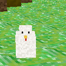
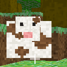
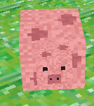

# PACMine 🟩⛏️

Небольшая воксельная песочница на **Java** с использованием [LWJGL](https://www.lwjgl.org/) (OpenGL + GLFW). Майнкрафт-подобная игра: ходи по сгенерированному миру, ломай и ставь блоки, добывай руду, сражайся с зомби.

> 🇬🇧 English version: [README.md](README.md)

---

## 📥 Скачать и играть

Самый простой способ — **лаунчер**. Скачай `PACMine-Launcher.jar` со страницы релизов:

➡️ **[Releases](https://github.com/PacHub228/PACMine/releases)**

Запусти (нужен установленный **JDK 21+**):
```
java -jar PACMine-Launcher.jar
```
Лаунчер сам скачает игру с GitHub, соберёт её и запустит. Кнопка **UPDATE** обновляет до свежей версии.

---

## 🎮 Управление

| Действие | Клавиша |
|---|---|
| Движение | `W` `A` `S` `D` |
| Прыжок | `Space` |
| Бег | зажать `Left Shift` |
| Осмотр | мышь |
| Сломать блок / ударить зомби | ЛКМ |
| Поставить блок | ПКМ |
| Выбрать блок | `1`–`8` или колёсико мыши |
| Пауза / меню | `Esc` |
| Полёт (креатив) | `Space` вверх, `Left Shift` вниз |

---

## ✨ Возможности

- 🌍 **Процедурная генерация** мира: холмы (шум Перлина), деревья, песок у воды
- 🧱 **Блоки:** трава, земля, камень, дерево, листва, песок, уголь, железо, бедрок
- ⛏️ **Руда жилами:** уголь по всей толще камня, железо — глубоко под землёй
- 🚶 **Физика от 1-го лица:** гравитация, прыжки, коллизии, **урон от падения**
- ⚔️ **Меч:** просто имей 3 куска дерева в инвентаре — меч скуётся сам (виден в руке), им можно убивать зомби
- 🧟 **Зомби:** преследуют игрока, наносят урон (полоска здоровья из сердец)
- 🐷 **Животные:** свинья, корова и курица — гуляют днём; убей и подбери сердечко, чтобы восстановить здоровье

| 🐔 Курица | 🐮 Корова | 🐷 Свинья |
|:---:|:---:|:---:|
|  |  |  |
- 🎒 **Хотбар-инвентарь** с иконками блоков
- 🗺️ **Меню миров:** создание/продолжение/удаление, настраиваемый размер (в чанках)
- 💾 **Сохранение и загрузка** миров на диск
- ⏸️ **Пауза** с сохранением, ⚙️ режимы (выживание/креатив), переключаемые мобы и защита
- 🚀 **Лаунчер** с авто-обновлением; поддержка Windows (вкл. софт-OpenGL для виртуалок)
- 💎 **Бесплатный премиум:** напиши боту [@pacmine_prem_bot](https://t.me/pacmine_prem_bot) в Telegram команду `/prem ТВОЙ_НИК` — и получи премиум (закреплённый ник + галочка на сервере). До 3 аккаунтов на один Telegram

---

## 🖥️ Выделенный сервер (ядро)

Как в майне: скачай `PACMine-Server.jar` из релизов (или собери: `bash make-server.sh`),
положи в пустую папку и запусти:
```bash
java -jar PACMine-Server.jar
```
При первом запуске ядро создаст в этой папке всё нужное:
- `server.properties` — настройки (порт, размер мира, защита, автосейв)
- `saves/world.pms` — мир (автосохранение + сохранение при остановке)
- `server.log` — лог

Команды консоли: `list` (кто онлайн), `plugins`, `save`, `stop`. Игроки подключаются через
МУЛЬТИПЛЕЕР → JOIN GAME по IP сервера. LWJGL ядру не нужен — работает на любом VPS.

### 🔌 Lua-плагины
Поставь `plugins=true` в server.properties — ядро создаст папку `plugins/` с документацией
и будет грузить из неё `.lua` файлы (компилированный `.luac` не принимается). API `pacmine.*`:
события join/leave/block/tick, get_block/set_block (с синхронизацией игрокам), players, kick.

---

## 🛠️ Сборка вручную

Нужен **JDK 21+**. Нативы LWJGL качаются под твою ОС.

**Linux / macOS:**
```bash
bash get-deps.sh   # скачать jar'ы LWJGL в lib/
bash build.sh      # скомпилировать в out/
bash run.sh        # запустить игру
```

**Windows:**
```bat
get-deps.bat
build.bat
run.bat
```

> ⚠️ **Версия для Windows не проверена и может иметь недочёты.** Все версии
> протестированы на **Linux Fedora 44 Workstation**.

---

## 📁 Структура проекта

```
src/com/voxel/
├── Main.java          — окно, игровой цикл, ввод, меню, HUD, бой
├── World.java         — генерация мира и хранение блоков
├── Noise.java         — 2D value-noise для рельефа
├── ChunkRenderer.java — построение меша по чанкам (display lists)
├── TextureAtlas.java  — загрузка текстур / атлас
├── Player.java        — движение, коллизии, здоровье, урон от падения
├── Zombie.java        — моб: ИИ и атака
├── SaveGame.java      — сохранение/загрузка мира
└── Font5x7.java       — пиксельный шрифт для меню
assets/                — PNG-текстуры 16×16
launcher/              — кроссплатформенный лаунчер (Swing)
```

---

## 👤 Авторы

- **PACHUB / PACPERLAR** — «гейм-директор»: гениально пишет промпты, рисует текстуры фломастером в 16×16 и говорит «не, это хуйня, сделай лучше»
- **Claude** (Anthropic) — делает почти всё остальное и не жалуется

*Честное распределение труда: один умеет только просить, второй не умеет отказывать.*

---

## 📜 Лицензия

[Apache 2.0](LICENSE) — используй свободно; версии до v0.1.5.5 включительно выходили под MIT.
